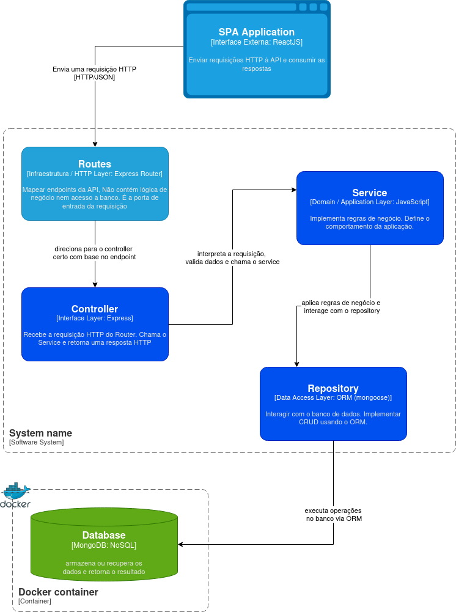
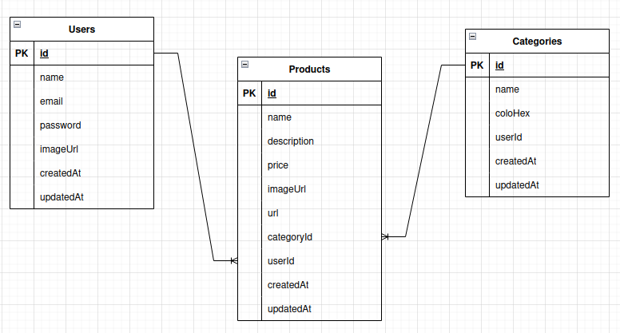

# 🧱 TaskDock API

> 🚧 **Under Construction** 🚧
> RESTful API developed using **Nodejs + Express**, responsible for managing user authentication and product CRUD operations. This project is part of the TaskDock system, a full-stack application containerized with **Docker**.

## 🚀 Technologies

- **Node.js**
- **Express.js**
- **MongoDB**
- **Mongoose**
- **JWT**
- **Docker & Docker Compose**

---

## 🧩 Architecture Overview

The system was developed with a modular architecture for better scalability and maintenance.

### Architecture Diagram

  

### Data Flow

  

---
